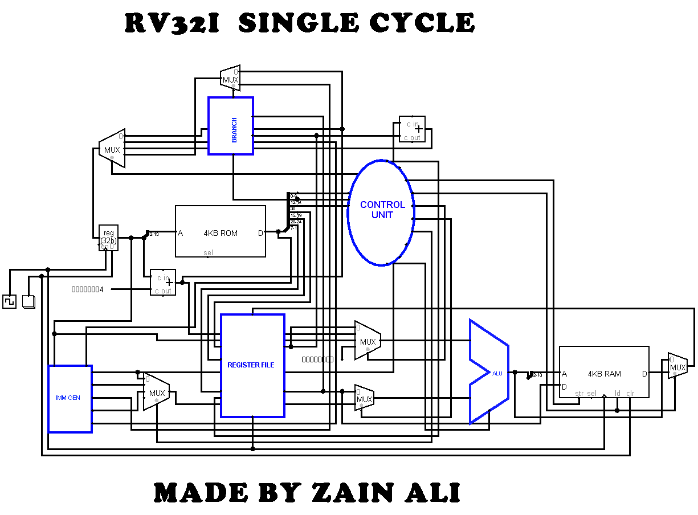

# RV32I Single Cycle Processor Logisim Simulation

## **Description**
This repository consists of RISC-V single cycle 32 bit datapath and control processor simulation called [Logisim.](http://www.cburch.com/logisim/download.html) A datapath contains all the functional units and connections necessary to implement an instruction set architecture. In single-cycle implementation, we use two separate memories,register file,an ALU, some extra adders, and lots of multiplexers.Processer is a 32-bit machine, so most of the buses are 32-bits wide.The control unit tells the datapath what to do, based on the instruction that’s currently being executed.Our processor has  control signals that regulate the datapath.The control signals can be generated by a combinational circuit with the instruction’s 32-bit binary encoding as input.Next, we’ll see the performance limitations of this single-cycle machine.

## **Componenents**
- Program Counter
- Memory Address Register
- Control Unit
   - Type Decode
   - Control Decode
- Branch Circuit
- Register File
- Immediate Generation
- ALU
- RAM


## **Under The Guidance Of**
- [Zeeshan Rafique](https://github.com/zeeshanrafique23)
- [Sajjad Ahmed](https://github.com/sajjadahmed677)

## **Pre-Req Tools**
- Logisim Software [Logisim.](http://www.cburch.com/logisim/download.html)
- Venus online simulator [Venus](https://venus.cs61c.org/)
- Git [Git](https://git-scm.com/downloads)
- Github [Github](https://github.com)

## **Designing Procedure and Working**

In a basic single-cycle implementation all operations take the same amount of time a single cycle.All instructions will execute in the same amount of time; this will determine the clock cycle time for our performance equations.firstly, the program counter or PC register holds the address of the current instruction it is just a 32-bit register which holds the instruction address and is updated at the end of every clock cycle.secondly, we have instruction memory.Instruction memory is a state element that provides read-access to the instructions of a program and, given an address as input, supplies the corresponding instruction at that address.thirdly, the control unit is responsible for setting all the control signals so that each instruction is executed properly.Type decode specify the types of instruction.Control Decoder depending upon the type of instruction ,op is the instruction opcode, and funcs  specifies a particular arithmetic operation.Register-to-register arithmetic instructions use the R-type format.Forthly, immediate generation that uses complete instruction and PC to generate the relevant  immediate then register file stores thirty-two 32-bit values.Each register specifier is 5 bits long.only can read from two registers at a time.RegWrite is 1 if a register should be written.The source registers, specified by instruction fields rs and rt, should be read from the register file.The ALU performs the desired operation.Its result is stored in the destination register, which is specified by field rd of the instruction word.Fiftly,built a  32-bit ALU with 4-bit ALU operation Select. It performs the arithmetic or logical operation specified by the instruction. This is how it is used for all arithmetic and logical instructions.and choose the process that follows the instructions.Add RAM and set its data bits to 32 bits and address width to 12 bits. Memory requires 32 (address) bits and 12 (write data) bits and just one output  32 bits.Finally,built a branch circuit to control branch instructions,Fetch the instruction,Read the source registers,Compare the values by subtracting them in the ALU.If the subtraction result is 0, the source operands were equal and the PC should be loaded with the target address, PC + 4 + (offset x 4).Otherwise the branch should not be taken, and the PC should just be incremented to PC + 4 to fetch the next instruction sequentially.Similar to branch, the jump instruction requires operand,immegate and perfoam add function so that why requied 32-bit adder for jalr.One ALU cannot perform 2 operation on a single cycle. Connect the wiring using the splitters, multiplexers, constants, tunnels, and clocks.To check the circuit,first use Venus Online RV32I Simulator. This Simulator helps grasp the working behind the instruction much faster.To load the machine code on the instruction register, copy the code on Venus, then copy the machine code using the dump feature and create the abdcode.mem extension file using All file saving option on notepad :
``` 
v2.0 raw
00500293
005E2023
000E2303
``` 
_(Save as .mm extension and remove 0x0 before loading in instruction memory)_

Match the output of each instruction according to the output observed in the Venus Online Simulator. Make notes of each component throughout the circuit design so that it can be of great help in the troubleshooting phase. Also upload this circuit to GitHub Remote Store from day one which can help you to replenish your circuit in the previous phase if you have any problems.

## **Instructions Supported**

1. add
2. addi
3. sub
4. xor
5. and
6. slt
7. sltu
8. sll
9. srl
10. sra
11. lw
12. jalr
13. slli
14. srli
15. srai
16. slti
17. sltiu
18. sw
19. auipc
20. lui
21. li
22. beq
23. bne
24. blt
25. bge
26. bltu
27. bgeu


## **Circuit SnapShot**


